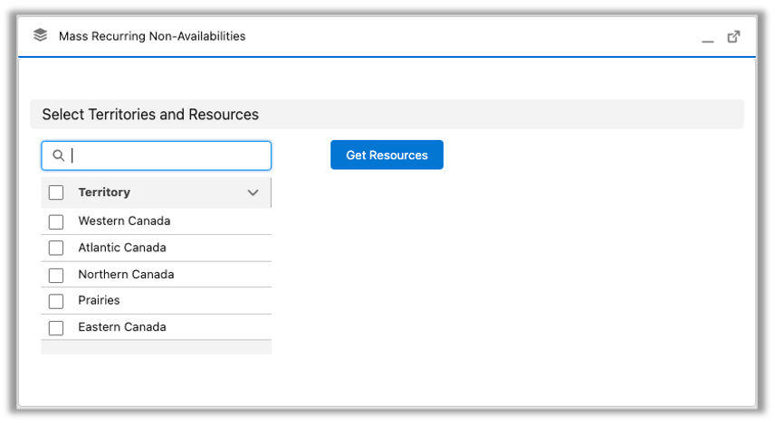

# Create Recurring Non-Availabilities

Use this workflow to create a recurring series of non-availabilities for multiple Service Resources at once.

**Step 1: Select territories and resources**

1. Open the **Mass Recurring Non-Availabilities** utility.
2. Select one or more **Service Territories**. 
 { width="700" }.   
   *Note: Service territories shown reflect your Gantt filtering settings. Service territories without assigned resources may still appear in the list.* 
3. Click **Get Resources**. 
   The Service Resource list displays the relevant resource names based on the Service Territories selected.  
4. Select one or more **Service Resources**.   
5. Select **Create Resource Absences**. 

**Step 2: Enter absence time details**

1. In the **Absence Time** section, select an **Absence Type**.  
   The values available depend on your organization’s configuration.

2. Select a **Start Time** and **Finish Time**.  
   Define the time range for each absence event.

3. Enter a **Gantt label** *(Optional)*.  
   Enter a label to display on the Gantt (for example, *Company Meeting*). If left blank, the absence type displays.

4. Select a **Gantt Color** *(Optional)*.  
   Select a color to apply to all absences in the series.

5. Select a **Time Zone** *(Optional)*.  
   By default, the utility uses your time zone. Resource absences display based on the viewing user’s time zone, but you can select a different time zone to simplify creation.

**Step 3: Configure recurrence**

1. In the **Recurrence Pattern** section, select a **Recurrence Period**:

    - Daily  
    - Weekly  
    - Monthly  
    - Annually

2. Configure the recurrence options based on the selected period:

    - **Weekly:** select recurrence days  
    - **Monthly:** choose recurrence by **Date** or **Day** (for example, *First Monday*)  
    - **Annually:** choose recurrence by **Date** or **Day** (for example, *First Wednesday of March*)

3. Enter the **Frequency**.
    
    **Example:** If you select **Weekly** and enter a frequency of `2`, the absence occurs every **two weeks**. 

**Step 4: Set the recurrence range and create records**

1. In the **Range of Recurrence**, select a **Start Date**.
2. Select an end option:

    - **End by** (choose an end date), or  
    - **End after** (enter the number of occurrences)

3. Click **Create**.

!!! success "Result: Records created"
    When you click **Create**, the utility generates:
    
    - A **Recurring Resource Absence** record (the parent series record)
    - Individual **Resource Absence** records (one per occurrence)

    Each Resource Absence record is linked to its parent series record.

    To review the absences created:

    1. Open the **Recurring Resource Absence** record.
    2. In the **Resource Absences** related list, click **View All** to see the full set of child records. 

    *Note: The Recurring Resource Absence record is automatically deleted after all related Resource Absence records in the series have been deleted.* 
